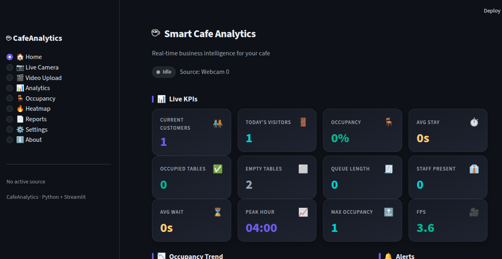
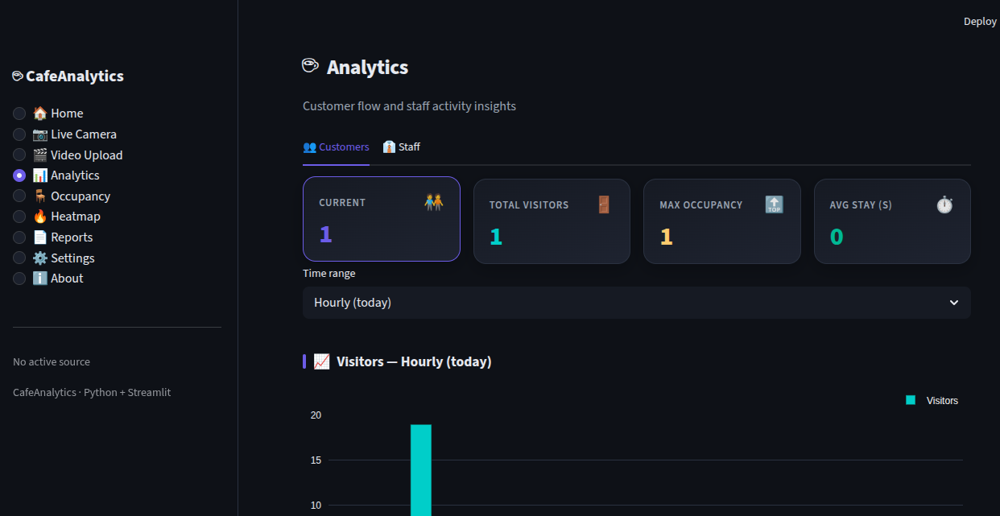
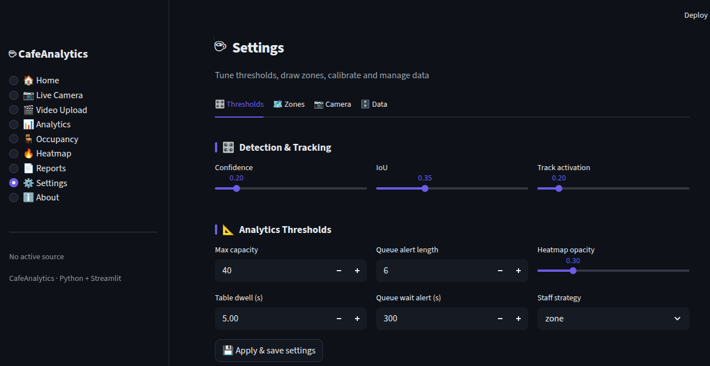
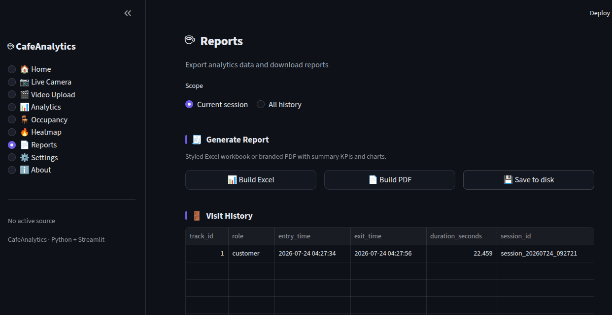

# ☕ CafeAnalytics

A production-grade, **real-time Smart Cafe Analytics platform**. It processes
a live camera feed or recorded video and turns it into business intelligence
for cafe owners — customer flow, staff activity, table occupancy, queue
monitoring, foot-traffic heatmaps, intelligent alerts and exportable reports —
all in **Python**, with a polished **Streamlit** dashboard.

## Demo

### DAshbored









---

##  Features

-  **Real-time detection** — YOLO26n via Ultralytics, behind a stable,
  swappable interface (change one config line to use a newer model).
-  **Multi-object tracking** — ByteTrack (Supervision) with persistent IDs,
  entry/exit events, dwell time and trajectories.
-  **Customer analytics** — current/total visitors, entries/exits, occupancy
  min/max/avg, stay-duration distribution, hourly→monthly roll-ups, peak hour.
-  **Staff analytics** — zone/colour/manual staff classification, attendance,
  working-vs-idle time, staff-to-customer ratio, presence timeline.
-  **Table occupancy** — occupied/empty/reserved status by proximity + dwell,
  occupancy %, utilisation over time.
-  **Queue monitoring** — per-zone length, wait times, longest waiter, trend,
  and threshold alerts (debounced).
-  **Heatmaps & trajectories** — decaying foot-traffic heatmaps (customer /
  staff), movement paths, most/least-visited zones.
-  **Intelligent alerts** — overcrowding, long queue, long wait, no staff on
  floor — with cooldown de-duplication.
-  **Interactive dashboard** — 9 pages, dark SaaS theme, Plotly charts, live
  auto-refresh, snapshots and recording.
-  **Reports** — CSV, styled multi-sheet Excel, and branded PDF with charts.
- **Persistence** — SQLite via SQLAlchemy (visits, events, snapshots,
  alerts, zones, reports, settings).

---

##  Architecture

```
Video source → detection → tracking → analytics ─┐
   (engine orchestrates: detect → track → annotate)│
                                                    ▼
                                          pipeline.Orchestrator
                                        (staff class. + 4 analyzers
                                         + heatmaps + alerts + snapshots)
                                                    │
                              ┌─────────────────────┼─────────────────────┐
                              ▼                      ▼                     ▼
                          database                dashboard             reports
                        (SQLAlchemy)              (Streamlit)         (CSV/Excel/PDF)
```

The **detector** sits behind a canonical `Detections` container, so YOLO26n can
be replaced without touching tracking, analytics or the UI. The
**`AnalyticsOrchestrator`** implements the same `process(frame) → FrameResult`
interface as the engine, so the threaded `LiveRunner` drives it unchanged.

---

##  Project Structure

```
CafeAnalytics/
├── app.py                     # Streamlit entry point (sidebar nav + routing)
├── config.py                  # Central typed config (YAML + env overrides)
├── requirements.txt
│
├── detection/                 # YOLO26n wrapper + canonical Detections + annotator
├── tracking/                  # ByteTrack wrapper + TrackManager (history/events)
├── engine/                    # DetectionEngine (per-frame) + threaded LiveRunner
├── analytics/                 # customer / staff / table / queue / heatmap + aggregates
├── pipeline/                  # AnalyticsOrchestrator (ties it all together)
├── database/                  # SQLAlchemy models + DatabaseManager
├── reports/                   # CSV / Excel / PDF report generator
├── dashboard/                 # Streamlit theme, components, state, pages/
├── utils/                     # logging, video/image, geometry, time helpers
│
├── models/                    # model weights (yolo26n.pt, git-ignored)
├── outputs/                   # snapshots / recordings / heatmaps (git-ignored)
├── videos/                    # sample + uploaded videos (git-ignored)
├── logs/                      # rotating log files (git-ignored)
├── reports/generated/         # generated report files (git-ignored)
└── scripts/                   # verify_phase*.py + verify_all.py
```

---

## 🛠️ Requirements

- Python 3.10+ (developed on 3.12)
- See `requirements.txt`. Key packages: `ultralytics`, `supervision<0.30`,
  `opencv-python`, `torch`/`torchvision`, `streamlit`, `plotly`, `pandas`,
  `SQLAlchemy`, `openpyxl`, `fpdf2`, `matplotlib`.

A **GPU is optional** — the platform runs on CPU (slower FPS; see Performance).

---

##  Installation

```bash
git clone https://github.com/haroon-aziz/ai-caffe-analytics.git
cd CafeAnalytics

python -m venv venv
source venv/bin/activate            # Windows: venv\Scripts\activate

# On a CPU-only machine, install CPU-only torch first to avoid ~2.5 GB of
# CUDA packages, then the rest:
pip install --index-url https://download.pytorch.org/whl/cpu torch torchvision
pip install -r requirements.txt
```

The `yolo26n.pt` weights download automatically on first run and are cached to
`models/`.

---

##  Running

```bash
source venv/bin/activate
streamlit run app.py
```

This opens `http://localhost:8501` in your browser automatically. On a
**remote/headless server**, run with `--server.headless true` and open the
printed URL (forward the port, e.g. `ssh -L 8501:localhost:8501 …`).

### Verify the install


##  Dashboard Overview

| Page | What it shows |
|------|----------------|
| **Home** | 12 live KPI cards, alerts, occupancy trend, visitors-by-hour |
| **Live Camera** | Webcam / RTSP with start/pause/stop, live frame + counters, snapshot |
| **Video Upload** | Analyse a recorded file with progress + preview |
| **Analytics** | Customer & staff deep-dive; hourly→monthly roll-ups; stay histogram |
| **Occupancy** | Table status (occupied/empty/reserved) + queue monitoring |
| **Heatmap** | Customer/staff foot-traffic heatmaps; most/least-visited zones |
| **Reports** | CSV/Excel/PDF export with summaries and charts |
| **Settings** | Thresholds, **visual zone editor**, camera calibration, data mgmt |
| **About** | Overview and tech stack |

---

##  Configuration

All settings live in `config.py` as typed dataclasses, resolved in three layers
(later overrides earlier):

1. Dataclass defaults.
2. `config.yaml` in the project root (or the path in `$CAFE_CONFIG`).
3. Environment variables `CAFE_<SECTION>_<FIELD>` (e.g.
   `CAFE_DETECTION_CONFIDENCE=0.4`).

Runtime changes from the **Settings** page are persisted to the database and
re-applied on the next launch. Inspect the resolved config with:

```bash
python config.py
```

Key knobs: `detection.model_path` / `confidence`, `tracking.tracker`,
`analytics.max_capacity` / `queue_length_alert` / `table_occupied_seconds` /
`staff_classification`, `performance.frame_skip` / `resize_width`,
`dashboard.theme`.

### Zones

Tables, queues, staff areas, ROIs and counting lines are drawn in
**Settings → Zones** (point-based editor with live preview) and stored in the
database. The orchestrator reloads them live.

---

##  Performance

Target is **20–30 FPS on a mid-range GPU**. On CPU, YOLO26n runs slower
(~5–8 FPS at 640px). Levers in `config.py`:

- `performance.frame_skip` — run the model every *N*th frame, reuse detections
  in between (e.g. `2` ≈ triples display rate).
- `performance.resize_width` — downscale frames before inference (boxes are
  scaled back to full resolution automatically).
- `detection.image_size` — smaller `imgsz` = faster inference.
- `detection.half_precision` — FP16 on capable GPUs.

The orchestrator prunes finished track history periodically to bound memory on
long runs (visits are already persisted before pruning).

---

##  Troubleshooting

| Symptom | Fix |
|--------|-----|
| `streamlit: command not found` | Activate the venv: `source venv/bin/activate` |
| Browser didn't open | Ensure `server.headless=false` (default) or open the printed URL |
| `Port 8501 is not available` | It's already running, or use `--server.port 8503` |
| Weights fail to download | Check network; or place `yolo26n.pt` in `models/` manually |
| Huge install / disk pressure | Install CPU-only torch first (see Installation) |
| Low FPS on CPU | Raise `frame_skip`, set `resize_width`, lower `image_size` |
| Webcam not found (server) | Use an RTSP URL or the Video Upload page instead |

Logs are written to `logs/cafe_analytics.log` (rotating).

---

##  Future Improvements

- Appearance-based **re-identification** for true repeat-visit detection
  (plain ByteTrack assigns a new ID after a long gap — `repeat_visits` is
  honestly reported as 0 today).
- Speed/dwell in real-world units via the pixels-per-metre calibration.
- Multi-camera support and per-camera dashboards.
- Scheduled report emailing and a REST API for external BI tools.
- Timezone-aware datetimes end-to-end.

---

##  License

Provided as-is for portfolio / evaluation use.

*Built with Python + Streamlit. Detection by Ultralytics YOLO26n, tracking by
Supervision ByteTrack.*
